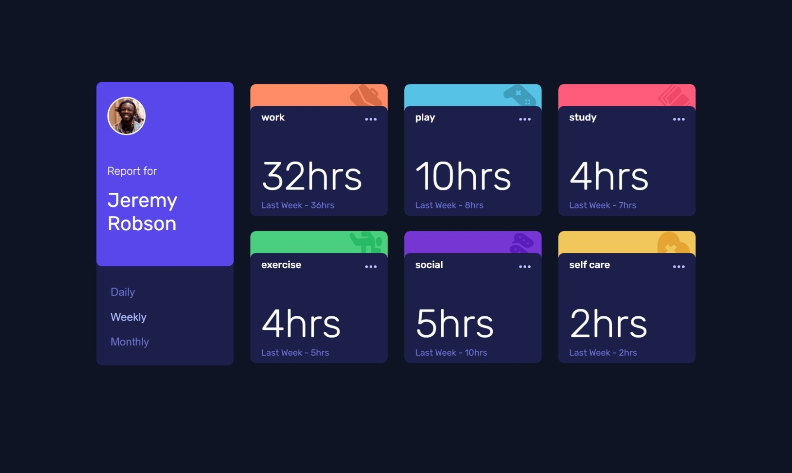
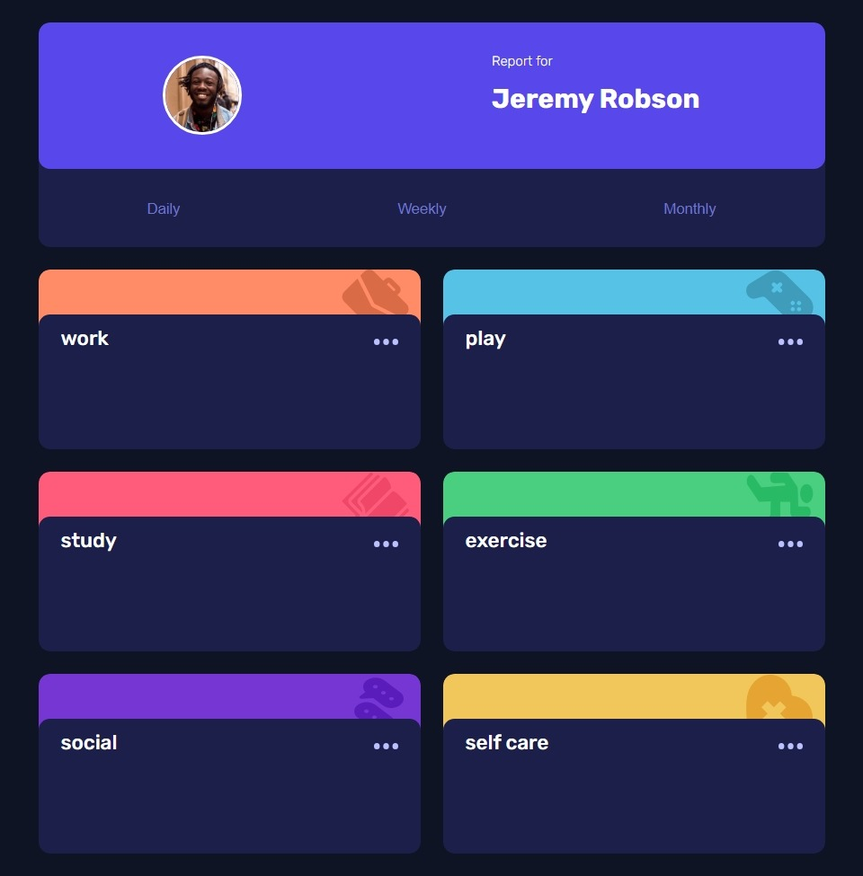
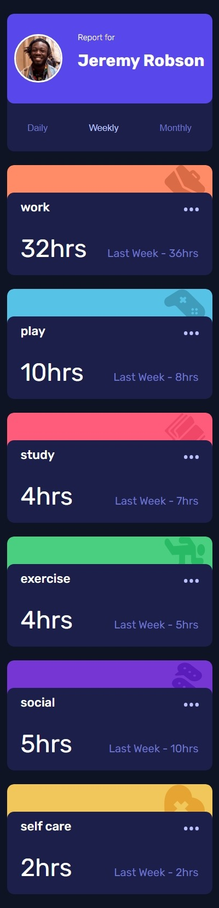

# Frontend Mentor - Time tracking dashboard solution

This is a solution to the [Time tracking dashboard challenge on Frontend Mentor](https://www.frontendmentor.io/challenges/time-tracking-dashboard-UIQ7167Jw). Frontend Mentor challenges help you improve your coding skills by building realistic projects.

## Table of contents

- [Overview](#overview)
  - [The challenge](#the-challenge)
  - [Screenshot](#screenshot)
  - [Links](#links)
- [My process](#my-process)
  - [Built with](#built-with)
  - [What I learned](#what-i-learned)
  - [Useful resources](#useful-resources)
- [Author](#author)

## Overview

### The challenge

Users should be able to:

- View the optimal layout for the site depending on their device's screen size
- See hover states for all interactive elements on the page
- Switch between viewing Daily, Weekly, and Monthly stats

### Screenshot





### Links

- Solution URL: [Add solution URL here](https://github.com/danielashjari/time-tracking-dashboard-main)
- Live Site URL: [Add live site URL here](https://your-live-site-url.com)

## My process

### Built with

- Semantic HTML5 markup
- CSS custom properties
- Flexbox
- CSS Grid
- Mobile-first workflow

### What I learned

- how to fetch and use json file.
- promises and async/await functions
- a review of css grid.

```css
  @include grid-columns(2, 20px); // Create a 2 column grid with 20px gap
```

```js
async function populate() {
    const requestURL = "../../data.json";
    const response = await fetch(requestURL);
    const data = await response.json();
    //rest of the code
}
```

### Useful resources

- [MDN json](https://developer.mozilla.org/en-US/docs/Learn_web_development/Core/Scripting/JSON#json_structure)

- [MDN promises](https://developer.mozilla.org/en-US/docs/Learn_web_development/Extensions/Async_JS/Promises)

- [W3schools async/await](https://www.w3schools.com/js/js_async.asp)

## Author

- Frontend Mentor - [@danielashjari](https://www.frontendmentor.io/profile/danielashjari)
